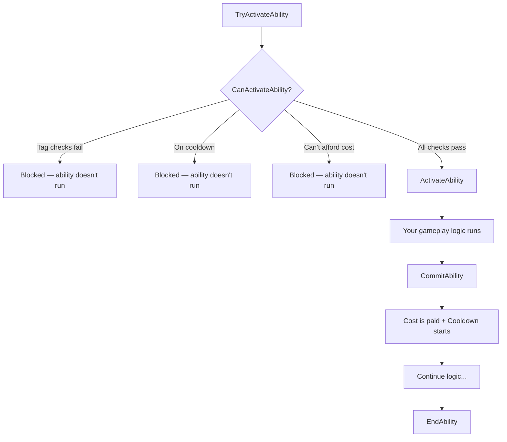

# Gameplay Abilities — The Big Picture

A **Gameplay Ability** (GA) represents a discrete action that a character can perform — an attack, a dodge roll, a spell cast, a block, a heal, an interaction. What makes GAS abilities more than just "run some code when a button is pressed" is their built-in framework for activation rules, costs, cooldowns, cancellation, and networking.

This page covers the concepts. For the complete deep dive, see the [Gameplay Abilities deep dive](../gameplay-abilities/index.md).

## What a Gameplay Ability Is

At its core, a Gameplay Ability is a `UGameplayAbility` subclass that defines:

- **When** it can activate (tag requirements, cooldown checks, cost checks)
- **What** it does (your gameplay logic — spawn projectile, play montage, apply effect)
- **What it costs** (mana, stamina, health — via a Cost Gameplay Effect)
- **How long** until it can be used again (via a Cooldown Gameplay Effect)
- **What it blocks** (other abilities that can't run while this one is active)

You create abilities as Blueprint subclasses of your C++ base ability class, then implement the logic in the Blueprint event graph. The framework handles activation checks, networking, instancing, and cleanup.

## The Activation Flow

When something triggers an ability, here's what happens:



Let's walk through each step:

### TryActivateAbility

The entry point. You call this from input handling, AI, or other gameplay code:

```cpp
ASC->TryActivateAbilityByClass(MyAbilityClass);
// or
ASC->TryActivateAbilityByTag(AbilityTag);
```

### CanActivateAbility

GAS runs a series of automatic checks:

1. **Is the ability granted?** (Was `GiveAbility` called?)
2. **Tag requirements met?** (Activation Required Tags present? Activation Blocked Tags absent?)
3. **Is it on cooldown?** (Does the cooldown tag exist?)
4. **Can the owner afford the cost?** (Enough mana/stamina?)
5. **Is another ability blocking it?** (Block/cancel tag interactions)

If any check fails, the ability doesn't activate. No code runs. This is the safety net that prevents firing a spell while stunned, using an ability on cooldown, or casting without enough mana — all without you writing a single if-statement.

### ActivateAbility

Your logic runs. This is the Blueprint event you override:

```cpp
// C++
virtual void ActivateAbility(
    const FGameplayAbilitySpecHandle Handle,
    const FGameplayAbilityActorInfo* ActorInfo,
    const FGameplayAbilityActivationInfo ActivationInfo,
    const FGameplayEventData* TriggerEventData
) override;
```

In Blueprint, this is the `Activate Ability` event — the starting point of your ability's logic.

### CommitAbility

This is where costs are actually paid and the cooldown starts:

```cpp
bool bCommitted = CommitAbility(Handle, ActorInfo, ActivationInfo);
```

!!! info "The commit pattern"
    `CanActivateAbility` checks if you *can* pay the cost. `CommitAbility` actually *pays* it. These are separate steps on purpose.

    Why? Because you might want to verify something between activation and payment. For example, a targeted ability might:

    1. `ActivateAbility` fires
    2. Check if there's a valid target in range
    3. If yes → `CommitAbility` (pay mana, start cooldown)
    4. If no → `EndAbility` (no cost spent, no cooldown)

    This pattern prevents spending resources on abilities that fail due to game state. If you don't need this, you can call `CommitAbility` immediately at the start of `ActivateAbility`.

### EndAbility

Every ability must eventually call `EndAbility`. This cleans up:

- Ends active ability tasks
- Removes any tags the ability was granting
- Notifies the ASC that the ability is finished
- Frees the instance (depending on instancing policy)

!!! danger "Forgetting to end"
    If you never call `EndAbility`, the ability stays "active" forever. This means its blocking tags stay active (potentially blocking other abilities), its resources aren't released, and depending on instancing, you may not be able to activate it again.

## Ability Tags

Every ability has four tag categories that control its interactions with other abilities and the actor's state:

| Tag Category | Purpose | Example |
|---|---|---|
| **Ability Tags** | Identity tags for this ability | `Ability.Skill.Fireball` |
| **Activation Required Tags** | Actor must have ALL of these tags | `State.Alive`, `State.Grounded` |
| **Activation Blocked Tags** | Actor must have NONE of these tags | `CrowdControl.Hard`, `State.Dead` |
| **Cancel Abilities With Tag** | When this ability activates, cancel any active abilities with these tags | `Ability.Skill` (cancels other skills) |

These four categories give you a declarative way to express complex interaction rules:

- "Fireball requires you to be alive and grounded, can't fire while hard-CCed, and cancels any other active skill when it starts."

All of that is pure configuration — no if-statements, no Blueprint logic. Just tags in the ability's defaults.

There are additional tag categories for more advanced interactions (block abilities with tag, source required/blocked tags). See [Lifecycle and Activation](../gameplay-abilities/lifecycle-and-activation.md) for the full list.

## Instancing Policy

Abilities have an instancing policy that controls how many instances of the ability exist:

| Policy | Behavior | Recommendation |
|---|---|---|
| **NonInstanced** | No instance — the CDO is used directly | Avoid unless you have a specific perf reason |
| **InstancedPerActor** | One instance per actor, reused across activations | **Recommended for most abilities** |
| **InstancedPerExecution** | New instance every activation | Use for abilities that need concurrent executions |

**InstancedPerActor** is the sweet spot for most games. The ability is instantiated once when granted, reused every time it activates, and you can store state on it between activations (combo counters, charge counts). It's also the most straightforward to debug.

NonInstanced runs on the Class Default Object and cannot have instance state — you can't store variables on it. InstancedPerExecution creates a new instance every time, which is useful for abilities that can run concurrently (e.g., a turret that can fire multiple tracking missiles simultaneously) but costs more memory and setup.

For the full tradeoff analysis, see [Instancing Policy](../gameplay-abilities/instancing-policy.md).

## Ability Tasks

Real abilities don't just run and finish in one frame. They play animations, wait for input, track targets, listen for events. **Ability Tasks** are asynchronous operations that let an ability "wait" without blocking the game thread:

```
ActivateAbility
    → Play Montage and Wait (ability task)
        → On Completed: Apply damage effect, EndAbility
        → On Cancelled: EndAbility
        → On Interrupted: EndAbility
```

Common ability tasks:

- `PlayMontageAndWait` — play an animation montage, get notified on complete/cancel/interrupt
- `WaitGameplayEvent` — wait for a gameplay event (e.g., "animation notify hit frame reached")
- `WaitInputPress` / `WaitInputRelease` — wait for player input
- `WaitTargetData` — wait for targeting information
- `WaitDelay` — simple timer

Ability Tasks handle their own cleanup when the ability ends. They're the backbone of any ability that takes more than one frame.

For the full catalog and how to create custom tasks, see [Ability Tasks](../gameplay-abilities/ability-tasks.md).

## Granting vs Activating

These are separate operations, and the distinction matters:

**Granting** (`GiveAbility`) makes an ability available to an actor. It adds the ability to the ASC's list of known abilities. Think of it as "learning a spell."

```cpp
FGameplayAbilitySpec Spec(AbilityClass, Level, InputID, SourceObject);
ASC->GiveAbility(Spec);
```

**Activating** (`TryActivateAbility`) runs a granted ability. Think of it as "casting the spell."

```cpp
ASC->TryActivateAbilityByClass(AbilityClass);
```

You can grant an ability without ever activating it (a passive that just contributes tags). You can try to activate an ability that was never granted (it will fail). You can grant abilities at different times — some at character creation, others when equipping items, others from gameplay events.

!!! tip "Common pattern"
    Grant your character's base abilities in `BeginPlay` (or when the ASC initializes). Grant equipment abilities when items are equipped, and remove them when unequipped. Grant temporary abilities from gameplay events (pickup, buff).

## The Base Ability Pattern

Almost every GAS project creates a project-level base ability class that sits between `UGameplayAbility` and your concrete abilities:

```
UGameplayAbility (engine)
    └── UMyProjectAbility (your base class — C++)
            ├── BP_Ability_Fireball (Blueprint)
            ├── BP_Ability_DodgeRoll (Blueprint)
            └── BP_Ability_Block (Blueprint)
```

Your base class is where you:

- Set the default instancing policy (InstancedPerActor)
- Add custom activation conditions
- Define helper functions your abilities share
- Set default tags (all abilities get `Ability` tag)
- Add project-specific properties (ability icon, description, input tag)

This is a one-time C++ setup that pays dividends — every Blueprint ability inherits a consistent foundation.

## What's Next

This page gave you the conceptual overview. The [Gameplay Abilities deep dive](../gameplay-abilities/index.md) covers:

- [Lifecycle and Activation](../gameplay-abilities/lifecycle-and-activation.md) — the full activation flow with every check and callback
- [Instancing Policy](../gameplay-abilities/instancing-policy.md) — detailed comparison with code examples
- [Ability Tasks](../gameplay-abilities/ability-tasks.md) — the full task system, custom tasks, and networking
- [Input Binding](../gameplay-abilities/input-binding.md) — connecting abilities to Enhanced Input
- [Ability Sets](../gameplay-abilities/ability-sets.md) — granting groups of abilities from data assets
