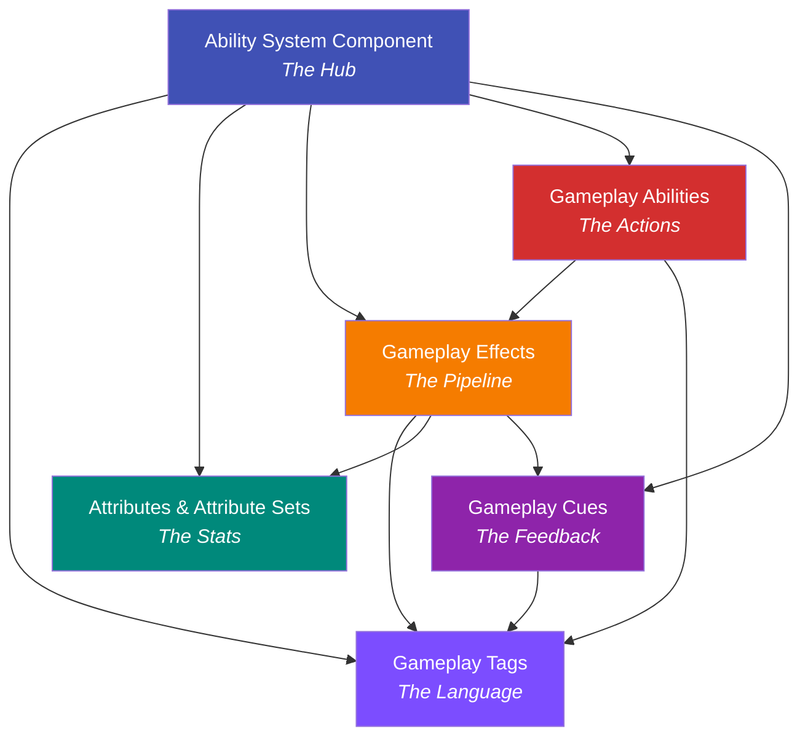

# Core Concepts

This section breaks down each of the six pieces of GAS in depth. The [Mental Model](../getting-started/mental-model.md) introduced them at a high level — here, you'll learn how each one actually works, what its API looks like, and where the gotchas hide.

## The Six Pieces

Every GAS feature is built from some combination of these:

| Piece | Page | Role |
|---|---|---|
| **Ability System Component** | [ASC](ability-system-component.md) | The hub — owns and orchestrates everything else |
| **Gameplay Tags** | [Tags](gameplay-tags.md) | The language — hierarchical labels that drive all GAS decisions |
| **Attributes & Attribute Sets** | [Attributes](attributes-and-attribute-sets.md) | The stats — numeric values like Health, Mana, Armor |
| **Gameplay Effects** | [Effects](gameplay-effects-overview.md) | The pipeline — the only way to modify attributes during gameplay |
| **Gameplay Abilities** | [Abilities](gameplay-abilities-overview.md) | The actions — discrete things a character can do |
| **Gameplay Cues** | [Cues](gameplay-cues-overview.md) | The feedback — VFX and SFX, cosmetic only |

## How They Depend on Each Other

These pieces aren't independent — they build on each other. Understanding the dependency chain helps you learn them in the right order.

Reading the diagram bottom-up:

- **Effects** depend on **Attributes** (they modify stats), **Tags** (they use tags for requirements and grants), and trigger **Cues** (for visual feedback).
- **Abilities** depend on **Effects** (they apply effects for costs, cooldowns, and results) and **Tags** (for activation rules).
- **Cues** depend on **Tags** (they're routed by GameplayCue.* tags) and are triggered by **Effects**.
- Everything flows through the **ASC**.

## Suggested Reading Order

You can read these pages in any order, but this sequence minimizes "wait, what's that?" moments:

1. **[Ability System Component](ability-system-component.md)** — Start here. It's the hub that owns everything else, so understanding it first gives you context for the rest.
2. **[Gameplay Tags](gameplay-tags.md)** — Tags are the language everything speaks. You'll see them referenced in every other page.
3. **[Attributes and Attribute Sets](attributes-and-attribute-sets.md)** — Your stats. Effects modify these, so learn what they are before learning how to change them.
4. **[Gameplay Effects](gameplay-effects-overview.md)** — The pipeline that modifies attributes, grants tags, and triggers cues.
5. **[Gameplay Abilities](gameplay-abilities-overview.md)** — The actions your characters perform. They use effects, tags, and attributes.
6. **[Gameplay Cues](gameplay-cues-overview.md)** — Visual and audio feedback. Depends on effects and tags.

After this section, the [Deep Dives](../gameplay-effects/index.md) go into exhaustive detail on Effects, Abilities, Cues, and Networking.
