# Example: Stamina Regeneration

<div class="example-badges" markdown>
  <span class="badge badge--beginner">Beginner</span>
</div>

A passive stamina regeneration system that pauses briefly after the player spends stamina, then resumes automatically. This example is different from every other example in this section -- it is **not an ability**. There is no `GameplayAbility` class, no input binding, no activation logic. The entire system is built from two Gameplay Effects and one tag.

This is one of the best introductions to how GAS systems communicate. Effects do work (modify attributes), tags control when that work happens, and the result is a data-driven behavior chain with zero code.

## What We're Building

- **Passive stamina regen** -- +3 Stamina per second, always active
- **Delay after use** -- regen pauses for 2 seconds after any ability spends stamina
- **Tag-driven control** -- a blocking tag pauses regen; a timed effect grants and removes that tag automatically
- **No ability required** -- applied at character startup, runs entirely through Gameplay Effects

## Prerequisites

!!! tip "What you need before starting"
    This example assumes you have completed [Project Setup](../getting-started/project-setup.md) and have:

    - A character with an **Ability System Component**
    - An **AttributeSet** with `Stamina` and `MaxStamina` attributes
    - A `PreAttributeChange` override that clamps `Stamina` to `[0, MaxStamina]` (so regen doesn't overshoot)
    - A **StartupEffects** array on your character class (a `TArray<TSubclassOf<UGameplayEffect>>` applied in `BeginPlay` or `InitializeAbilityActorInfo`)

    If any of that is missing, start with [Project Setup](../getting-started/project-setup.md).

---

## How Tags Control Effects

Before building anything, it's worth understanding the pattern we're about to use. This is the core mechanism behind most GAS systems.

**Effects do things.** A Gameplay Effect can modify attributes, grant tags, block abilities, and more. It's the workhorse.

**Tags are flags.** A Gameplay Tag is a name -- like `State.StaminaRegenBlocked` -- that exists on an actor's ASC. Tags don't do anything on their own. They're signals that other systems check.

**Effects can both grant tags and check for tags.** This is the key insight. One effect grants a tag to the actor. Another effect has an Ongoing Tag Requirement that checks for that tag. When the tag is present, the second effect pauses. When the tag is removed, the second effect resumes.

**The result: data-driven behavior chains.** No C++ callbacks, no Blueprint wiring, no event dispatchers. One effect controls another purely through the tag system. This is the pattern we'll use for stamina regen.

```mermaid
flowchart LR
    A["Ability commits"]:::effect --> B["GE_StaminaRegenDelay\napplied"]:::effect
    B --> C["Tag granted:\nState.StaminaRegenBlocked"]:::tag
    C --> D["GE_StaminaRegen\npauses"]:::state
    D --> E["2 seconds pass"]:::state
    E --> F["Delay expires\ntag removed"]:::tag
    F --> G["GE_StaminaRegen\nresumes"]:::result

    classDef effect fill:#2a2a4a,stroke:#9b89f5,color:#fff
    classDef tag fill:#5c1a1a,stroke:#ff6666,color:#fff
    classDef state fill:#1a3a5c,stroke:#4a9eff,color:#fff
    classDef result fill:#1a4a2d,stroke:#6bcb3a,color:#fff
```



---

## Step 1: Create GE_StaminaRegen

This is the core regen effect. It adds Stamina every second, runs forever, and pauses when a specific tag is present.

**Asset:** `GE_StaminaRegen` (Gameplay Effect Blueprint)

| Setting | Value |
|:---|:---|
| **Duration Policy** | Infinite |
| **Period** | `1.0` seconds |
| **Modifiers[0] -- Attribute** | `YourProjectAttributeSet.Stamina` |
| **Modifiers[0] -- Modifier Op** | `Add` |
| **Modifiers[0] -- Magnitude** | Scalable Float: `3.0` |

**Ongoing Tag Requirements (via `UTargetTagRequirementsGameplayEffectComponent`):**

| Requirement | Tag |
|:---|:---|
| **Ignore Tags** | `State.StaminaRegenBlocked` |

### What "Ongoing Tag Requirements -- Ignore Tags" means

This is the mechanism that makes the whole system work, so it's worth explaining clearly.

Ongoing Tag Requirements are checked **continuously** while the effect is active. They're different from Application Requirements, which are only checked once when the effect is first applied.

**Ignore Tags** means: *while any of these tags are present on the target, inhibit (pause) this effect.* The effect isn't removed -- it's temporarily suppressed. Its modifiers stop contributing to attribute calculations, and its periodic executions stop firing. The moment the blocking tag is removed, the effect resumes as if nothing happened.

In our case: while `State.StaminaRegenBlocked` is on the character, `GE_StaminaRegen` pauses. No stamina is added. When the tag is removed, regen ticks resume.

!!! info "Inhibited, not removed"
    An inhibited effect is still in the Active GE Container. It still appears in `showdebug abilitysystem`. It just isn't doing anything. This is important -- if the effect were removed, you'd need to reapply it. Inhibition is automatic and reversible.

---

## Step 2: Create GE_StaminaRegenDelay

This effect is applied by abilities when they spend stamina. It grants the blocking tag for 2 seconds, which pauses regen.

**Asset:** `GE_StaminaRegenDelay` (Gameplay Effect Blueprint)

| Setting | Value |
|:---|:---|
| **Duration Policy** | Has Duration |
| **Duration Magnitude** | Scalable Float: `2.0` |

**Tags (via `UTargetTagsGameplayEffectComponent`):**

| Tag Type | Tag |
|:---|:---|
| **Granted Tags** | `State.StaminaRegenBlocked` |

This effect has no modifiers -- it doesn't change any attributes. Its only job is to grant `State.StaminaRegenBlocked` for 2 seconds. When the duration expires, the effect is removed, the tag is removed, and `GE_StaminaRegen` resumes.

!!! note "Stacking behavior: timer reset on re-application"
    If the player uses another ability while the delay is already active, `GE_StaminaRegenDelay` is applied again. By default, when a Has Duration effect with no stacking configuration is re-applied from the same source, the new application creates a separate instance. Both instances grant the same tag, but the tag only needs one source to stay active.

    If you want the timer to **reset** cleanly (one instance, refreshed duration), configure stacking:

    | Stacking Setting | Value |
    |:---|:---|
    | **Stacking Type** | Aggregate By Target |
    | **Stack Limit Count** | `1` |
    | **Stack Duration Refresh Policy** | Refresh On Successful Application |

    With this configuration, re-applying the delay restarts the 2-second window instead of creating a second instance. Either approach works -- the tag stays present until all instances expire. The stacking approach is cleaner. See [Stacking](../gameplay-effects/stacking.md) for full details.

---

## Step 3: Apply Regen at Startup

`GE_StaminaRegen` needs to be applied when the character spawns. The standard approach is to add it to the character's **StartupEffects** array.

In your character Blueprint (or C++ class), find the `StartupEffects` array and add `GE_StaminaRegen`:

=== "Blueprint"

    1. Open your character Blueprint
    2. In the Details panel, find `StartupEffects` (a `TArray<TSubclassOf<UGameplayEffect>>`)
    3. Add an entry: `GE_StaminaRegen`

=== "C++"

    ```cpp
    // In your character constructor or header
    UPROPERTY(EditDefaultsOnly, Category = "GAS|Startup")
    TArray<TSubclassOf<UGameplayEffect>> StartupEffects;
    ```

    ```cpp
    // In BeginPlay or InitializeAbilityActorInfo (after ASC is ready)
    for (const TSubclassOf<UGameplayEffect>& EffectClass : StartupEffects)
    {
        if (EffectClass)
        {
            FGameplayEffectContextHandle Context = AbilitySystemComponent->MakeEffectContext();
            Context.AddSourceObject(this);
            FGameplayEffectSpecHandle Spec = AbilitySystemComponent->MakeOutgoingSpec(
                EffectClass, 1, Context);
            AbilitySystemComponent->ApplyGameplayEffectSpecToSelf(*Spec.Data.Get());
        }
    }
    ```

!!! warning "Don't add GE_StaminaRegenDelay to StartupEffects"
    Only the regen effect goes in StartupEffects. The delay effect is applied on-demand by abilities. If you add the delay to StartupEffects, regen will be blocked for 2 seconds every time the character spawns.

---

## Step 4: Wire Abilities to Apply the Delay

Any ability that spends stamina should apply `GE_StaminaRegenDelay` after committing. This includes jump, attack, dodge, sprint end -- anything where stamina is consumed.

The pattern is simple: after `CommitAbility` succeeds, apply the delay effect to the owner.

=== "Blueprint"

    In your ability's Event Graph, after the **CommitAbility** node:

    1. **Apply Gameplay Effect to Owner** (or **Apply GE to Self**)
    2. Set Class to `GE_StaminaRegenDelay`

    That's it. One node after CommitAbility.

    ```mermaid
    flowchart LR
        A["CommitAbility"]:::func --> B["Apply GE to Owner\nGE_StaminaRegenDelay"]:::func
        B --> C["...rest of ability logic"]:::task

        classDef func fill:#4527a0,stroke:#7e57c2,color:#fff
        classDef task fill:#0d47a1,stroke:#42a5f5,color:#fff
    ```

=== "C++"

    ```cpp
    // Inside your ability's ActivateAbility, after CommitAbility succeeds
    if (CommitAbility(Handle, ActorInfo, ActivationInfo))
    {
        // Apply the regen delay
        if (StaminaRegenDelayEffectClass)
        {
            FGameplayEffectSpecHandle DelaySpec =
                MakeOutgoingGameplayEffectSpec(StaminaRegenDelayEffectClass, GetAbilityLevel());
            ApplyGameplayEffectSpecToOwner(Handle, ActorInfo, ActivationInfo, DelaySpec);
        }

        // ... rest of ability logic
    }
    ```

    Where `StaminaRegenDelayEffectClass` is a UPROPERTY on your base ability class:

    ```cpp
    UPROPERTY(EditDefaultsOnly, Category = "Effects")
    TSubclassOf<UGameplayEffect> StaminaRegenDelayEffectClass;
    ```

!!! tip "Put it on the base class"
    If most of your abilities cost stamina, consider adding `StaminaRegenDelayEffectClass` as a property on your base `YourProjectGameplayAbility` class and applying it automatically in a shared `CommitAbility` override or a helper function. That way you don't have to remember to add it to every ability individually.

---

## Step 5: Test

### Basic Regen Test

1. PIE
2. Open the console and run `showdebug abilitysystem`
3. Watch `Stamina` -- it should tick up by 3 every second until it reaches `MaxStamina`
4. Use an ability that costs stamina (attack, dodge, jump)
5. Watch `Stamina` stop regenerating for 2 seconds
6. After 2 seconds, regen resumes
7. Spam the ability rapidly -- the 2-second delay should keep resetting, and regen should stay paused until 2 seconds after the last use

### What to look for in showdebug

- `GE_StaminaRegen` should always be listed in active effects (it's infinite)
- When the delay is active, `State.StaminaRegenBlocked` should appear in the active tags
- `GE_StaminaRegenDelay` should appear in active effects during the 2-second window, then disappear
- When `State.StaminaRegenBlocked` is present, `GE_StaminaRegen` should show as **inhibited**

### Edge Cases

| Scenario | Expected Result |
|:---|:---|
| Stamina already at MaxStamina | Regen ticks fire but `PreAttributeChange` clamps -- no overshoot |
| Ability used at 0 Stamina | Delay still applies, regen still pauses (delay is independent of regen) |
| Two abilities used 1 second apart | Second application resets the 2-second window (with stacking config) or creates a parallel instance (without) -- either way, tag stays active |
| Ability used while delay already active | Regen stays paused, delay timer extends or overlaps |
| Character dies during delay | Effect cleanup depends on your death handling -- if you clear all effects on death, both are removed |

---

## The Full Flow

Here's the complete sequence from ability use to regen resuming:

```
1. Player uses an ability that costs stamina (e.g., dodge roll)
   |
2. Ability calls CommitAbility -- stamina is deducted
   |
3. Ability applies GE_StaminaRegenDelay to owner
   |
4. GE_StaminaRegenDelay grants State.StaminaRegenBlocked tag (2s duration)
   |
5. GE_StaminaRegen detects the tag via Ongoing Tag Requirements (Ignore Tags)
   |
6. GE_StaminaRegen is inhibited -- periodic ticks stop, no stamina added
   |
7. 2 seconds pass...
   |
8. GE_StaminaRegenDelay expires and is removed
   |
9. State.StaminaRegenBlocked tag is removed (no remaining sources)
   |
10. GE_StaminaRegen is uninhibited -- periodic ticks resume
    |
11. Stamina begins regenerating again (+3/sec)
```

---

## Variations

??? example "Tiered Regen -- speed increases over time"
    Instead of a flat +3 per second, use multiple regen effects with different Ongoing Tag Requirements to create tiers. For example:

    - `GE_StaminaRegen_Slow` -- +2/sec, always active (base regen)
    - `GE_StaminaRegen_Fast` -- +5/sec additional, requires `State.StaminaRegen.Tier2`

    A separate effect grants `State.StaminaRegen.Tier2` after 3 seconds of uninterrupted regen. If the player uses stamina, the delay blocks the base regen, the tier tag is removed, and the player starts over at the slow rate.

    Alternatively, use a curve table with the modifier magnitude to scale regen based on how long the effect has been active.

??? example "Combat Regen vs Out-of-Combat Regen"
    Instead of per-ability delays, use a single `State.InCombat` tag. Apply a long-duration effect that grants `State.InCombat` whenever the player deals or takes damage. Set the regen effect's Ignore Tags to `State.InCombat`.

    This gives you classic MMO-style out-of-combat regeneration. The regen rate can be much higher (full recovery in 10-15 seconds) because it only activates when the player is safe.

??? example "Health Regen -- same pattern, different attribute"
    This exact pattern works for Health regeneration. Duplicate `GE_StaminaRegen`, change the modifier attribute to `Health`, and use a different blocking tag like `State.HealthRegenBlocked`. Health regen delay is typically longer (3-5 seconds) and the rate lower (+1/sec).

    You can have both stamina regen and health regen running simultaneously with independent delay timers.

??? example "Regen Buff -- temporary regen rate increase"
    Create a Duration effect (e.g., 30 seconds) that adds a second modifier to Stamina. While active, the character regenerates from both the base `GE_StaminaRegen` (+3/sec) and the buff effect (+5/sec) for a total of +8/sec.

    The buff effect can share the same Ongoing Tag Requirement (`State.StaminaRegenBlocked`) so it also pauses during the delay, or it can ignore the delay tag entirely for a "regen even during combat" power-up.

---

## Related Pages

- [Gameplay Effects Overview](../gameplay-effects/index.md) -- fundamentals of Gameplay Effects
- [Tags and Requirements](../gameplay-effects/tags-and-requirements.md) -- full reference for Ongoing Tag Requirements, Ignore Tags, and Application Requirements
- [Stacking](../gameplay-effects/stacking.md) -- how to configure duration refresh and stack limits
- [Cooldowns and Costs](../gameplay-effects/cooldowns-and-costs.md) -- how abilities commit cost effects (where the delay gets applied)
- [Gameplay Tags](../core-concepts/gameplay-tags.md) -- tag hierarchy design and conventions
- [Tag Design Patterns](../patterns/tag-design.md) -- best practices for tag naming and state management
- [Troubleshooting](../debugging/troubleshooting.md) -- common issues with effects not applying or tags not registering
- [Sprint Toggle](sprint.md) -- another stamina-based example with periodic drain
- [Dodge Roll](dodge-roll.md) -- an ability that costs stamina (good candidate for applying the delay)
- [Melee Attack](melee-attack.md) -- another stamina-cost ability to wire up with the delay
