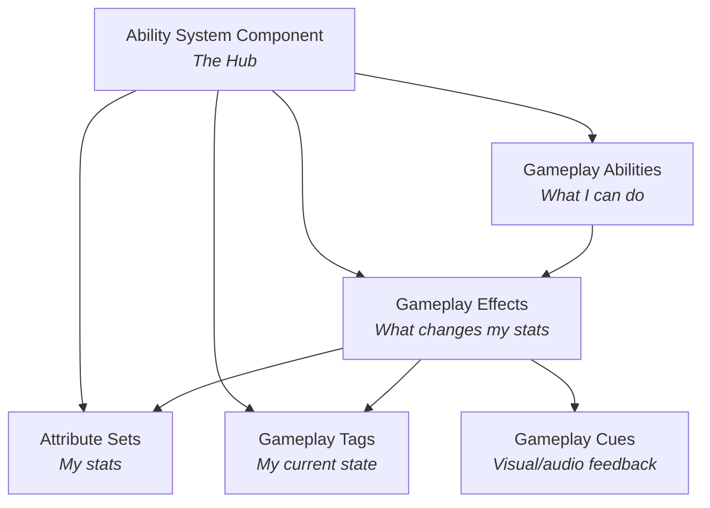

# How to Think About GAS

This is the most important page in this guide. Everything else builds on the mental model presented here. Take your time with it.

## The Six Pieces

GAS is built from six interconnected pieces. Every GAS feature, pattern, and technique involves some combination of these:

| Piece | What It Is | What It Does |
|---|---|---|
| **Ability System Component (ASC)** | An ActorComponent | The hub. Lives on your character, owns and manages everything else. |
| **Gameplay Ability (GA)** | A UObject subclass | A discrete action: attack, dash, cast spell, block. Has activation rules, costs, cooldowns. |
| **Gameplay Effect (GE)** | A data asset | A stat modification: deal damage, grant buff, apply DoT. The *only* way to change attributes. |
| **Attribute Set** | A UObject subclass | A container of numeric stats: Health, Mana, MoveSpeed. Holds BaseValue and CurrentValue. |
| **Gameplay Tags** | Hierarchical labels | The language of GAS. `State.Dead`, `Damage.Type.Fire`, `Cooldown.Ability.Dash`. |
| **Gameplay Cue (GC)** | A notify/actor | VFX and SFX feedback. Fire particles, hit sounds, buff auras. Cosmetic only — no gameplay logic. |

## How They Connect

The ASC is the center of everything. It owns the abilities, manages active effects, holds the attribute sets, and tracks which tags are currently present. When something happens in GAS, it flows through the ASC.

Here's what happens when a character casts a fireball at an enemy:

??? example "Step-by-step: Fireball hits an enemy"

    1. **Input fires** — the player presses a key bound to `InputTag.Combat.Primary`
    2. **ASC activates the Fireball Ability** — it checks: does the owner have any blocking tags (`State.Dead`, `CrowdControl.Hard`)? Is the ability on cooldown? Can the owner afford the mana cost?
    3. **The ability runs** — it plays a cast animation, spawns a projectile, waits for impact
    4. **On hit, the ability creates a Gameplay Effect Spec** — "deal X fire damage" with the damage amount set via SetByCaller
    5. **The effect is applied to the target's ASC** — it modifies the target's `PendingDamage` attribute
    6. **PostGameplayEffectExecute fires** on the target — the damage pipeline runs: check armor, check shields, subtract from Health, check for death
    7. **Tags update** — the target gains `Status.DamageOverTime.Burn` from the effect
    8. **A Gameplay Cue fires** — fire VFX and a hit sound play on the target (cosmetic only)

Every step in this flow uses a different piece of GAS. The ability triggers the effect. The effect modifies attributes and grants tags. The cue provides feedback. All of it flows through the ASC.

## The Key Insight: Tags Are the Language

If there's one thing to internalize, it's this: **tags are how everything in GAS communicates**.

- An ability checks tags to decide if it can activate: *"Am I stunned? Am I dead?"*
- An effect grants tags to change state: *"You are now burning."*
- Another ability checks those tags: *"Can't heal while burning."*
- A cue listens for tags to know what to show: *"Burning? Play fire particles."*

Tags replace boolean state machines. Instead of `bIsStunned`, `bIsBurning`, `bIsInvulnerable` — you check for `CrowdControl.Hard.Stun`, `Status.DamageOverTime.Burn`, `State.Invulnerable`. The advantage? Tags are granted and removed by effects automatically. You never forget to flip a bool back to false.

Tags are also hierarchical. `CrowdControl.Hard.Stun` is a child of `CrowdControl.Hard`, which is a child of `CrowdControl`. If you check for `CrowdControl`, it matches *any* crowd control type — stun, freeze, fear, all of them. One query instead of checking every CC type individually.

## Effects Are the Pipeline, Not Direct Modification

Another critical mindset shift: **you never modify attributes directly during gameplay**. No `SetHealth(50)`. No `Health -= damage`.

Instead, everything goes through Gameplay Effects:

- Want to deal damage? Create a damage effect and apply it.
- Want to heal? Create a healing effect and apply it.
- Want to buff MaxHP by 50 for 10 seconds? Create a duration effect that adds 50 to MaxHP. When it expires, the +50 is automatically removed.

Why this indirection? Because the effect pipeline gives you:

- **Automatic undo** — duration effects reverse themselves. No cleanup code.
- **Networking** — effects replicate properly. Direct sets don't.
- **Stacking rules** — what happens when the same buff is applied twice? GAS handles it.
- **Tag grants** — effects can grant tags while active, automatically removed when the effect ends.
- **Prediction** — clients can predict effect application for responsive gameplay.
- **Centralized processing** — your `PostGameplayEffectExecute` function is the single place where all damage, healing, and stat changes get processed. Armor, shields, death checks — all in one spot.

## BaseValue vs CurrentValue

Every GAS attribute has two numbers:

| Value | What It Represents | Example |
|---|---|---|
| **BaseValue** | The permanent, underlying value | MaxHealth = 100 |
| **CurrentValue** | BaseValue + all active modifiers | 100 + 50 (buff) = 150 |

**Instant** effects modify the BaseValue directly (permanent change — dealing damage, healing, leveling up).

**Duration** and **Infinite** effects modify the CurrentValue by adding a modifier on top of BaseValue. When the effect expires, the modifier is removed and CurrentValue recalculates.

This is the magic that makes buff/debuff systems work without cleanup code. The base was never touched. The modifier is just... gone.

## C++ vs Blueprint: The Split

GAS requires a small C++ foundation. Here's the honest breakdown:

### Must be C++ (set up once, rarely touch again)

- **Character base class** — implements `IAbilitySystemInterface` (a C++ interface)
- **Attribute Set** — attributes must be declared as `UPROPERTY` in C++
- **Base Ability class** — sets instancing policy, adds your custom properties
- **Input wiring** — the routing code in `SetupPlayerInputComponent`
- **Build.cs + .uproject** — module dependencies and plugin activation

### Done in Blueprint / Editor (daily work)

- **Gameplay Abilities** — Blueprint subclasses of your C++ base
- **Gameplay Effects** — pure data assets, configured in the editor
- **Gameplay Cues** — Blueprint assets for VFX/SFX
- **Input Actions** — editor assets for Enhanced Input
- **Ability configuration** — tags, cooldowns, costs, all set in Blueprint defaults
- **Balance tuning** — DataTable values, effect magnitudes

!!! tip "Think of it like plumbing"
    C++ is the plumbing you install once. Blueprint is the furniture you rearrange constantly. After the initial setup, you can go weeks without touching C++ — all new abilities, effects, and bindings are Blueprint and editor work.

## Thinking in GAS vs Thinking in Blueprint

If you come from a pure Blueprint background, GAS requires a mindset shift:

| Blueprint Habit | GAS Way |
|---|---|
| `bIsStunned` boolean variable | `CrowdControl.Hard.Stun` tag (granted by an effect) |
| `Health -= damage` in event graph | Apply a damage GameplayEffect to PendingDamage |
| Timer + manual cleanup for buff | Duration GameplayEffect (auto-expires, auto-undoes) |
| `Branch` node to check if stunned before attacking | Ability's `Activation Blocked Tags` includes `CrowdControl.Hard` |
| Cast to specific class to check status | Query tags on the target's ASC |

The GAS way is more indirect, but it scales. Adding a new CC type (freeze, fear, charm) requires zero changes to existing abilities — they already block on `CrowdControl.Hard`. Adding a new buff type requires zero cleanup code — the duration effect handles it.

## What's Next

Now that you have the mental model, let's put it into practice. Head to [Project Setup](project-setup.md) to enable GAS in your project and create the C++ foundation.
